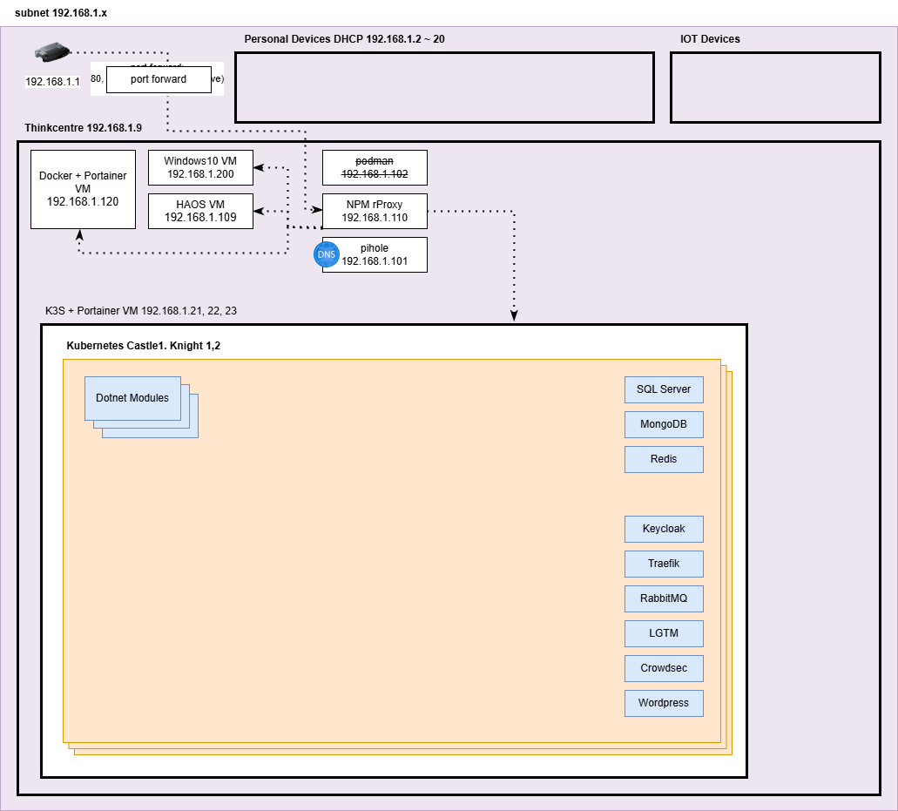

# Technicalisto

## IOS Swift : Training for ARWorldTrackingConfiguration Using RealityKit for ARView & ARKit for ARAnchor

## Add some furniture to the room and control the translation, rotation and scale

Note : 
       for easy understand firstly read this file ** once ** 
       & follow steps in new project from this [ReadMe](https://github.com/AyaBaghdadi/furniture_ar/tree/main) file or from this [Video]()
       
[comment]: <  >

## Let's Start 

1. Create Your Sesign of ViewController incluse it [ ARView ] & connect it.

```
import RealityKit
import ARKit
```

2. Add Your Models Ojects -> i added it with .usdz -> You can download any free models & Try it in this project 

```
Note : In this Example Models (objects) Must can add in surface ...
```

3. Add Your extension for use session delegate  

```
extension MainVC : ARSessionDelegate {
    
    func session(_ session: ARSession, didAdd anchors: [ARAnchor]) {
        
    }
}
```

4. In ViewConteroller inside viewDidAppear add session delegate

```
 arView.session.delegate = self

```

5. & setup your configration & Run

```
 arView.automaticallyConfigureSession = false
        
 let configuration = ARWorldTrackingConfiguration()
 configuration.planeDetection = [.horizontal,.vertical]
 configuration.environmentTexturing = .automatic
 arView.session.run(configuration)
 
```

6. & add Gesture for handle tapped in ARView

```
 arView.addGestureRecognizer(UITapGestureRecognizer(target: self, action: #selector(handleTap(recognizer:))))

```

7. & add method for handle this tapped for add object

```
    @objc
    func handleTap(recognizer:UITapGestureRecognizer){
        
        let location = recognizer.location(in: arView)
        
        let results = arView.raycast(from: location, allowing: .estimatedPlane, alignment: .horizontal)
        
        if let firstResult = results.first {
            
            let anchor = ARAnchor(name: self.selectedModel, transform: firstResult.worldTransform) // selectedModel
            
            arView.session.add(anchor: anchor)
            
            self.showToast(message: "You Add a New Object in your Place")

        }else{
            self.showToast(message: "Placement failed - coudn't find surface")
        }
    }

```

8. Add Method placeObject 

```
    func placeObject(named entityName:String , for anchor: ARAnchor) {
        
        let entity = try! ModelEntity.loadModel(named: entityName)
        
        entity.generateCollisionShapes(recursive: true)
        
        arView.installGestures([.all], for: entity) // translation, rotation and scale
        
        let anchorEntity = AnchorEntity(anchor: anchor)
        
        anchorEntity.addChild(entity)
        
        arView.scene.addAnchor(anchorEntity)
        
    }
```

9. In ARSessionDelegate in didAdd delegate call placeObject with anchor

```
        for anchor in anchors {
            
            if let anchorName = anchor.name, anchorName == self.selectedModel { // selectedModel
                placeObject(named: anchorName , for: anchor)
            }
            
        }
        
```
        
### Thanks

This app is inspired by Aya Baghdadi”
and copyright for [@Technicalisto](https://www.youtube.com/channel/UC7554uvArdSxL4tlws7Wf8Q)
